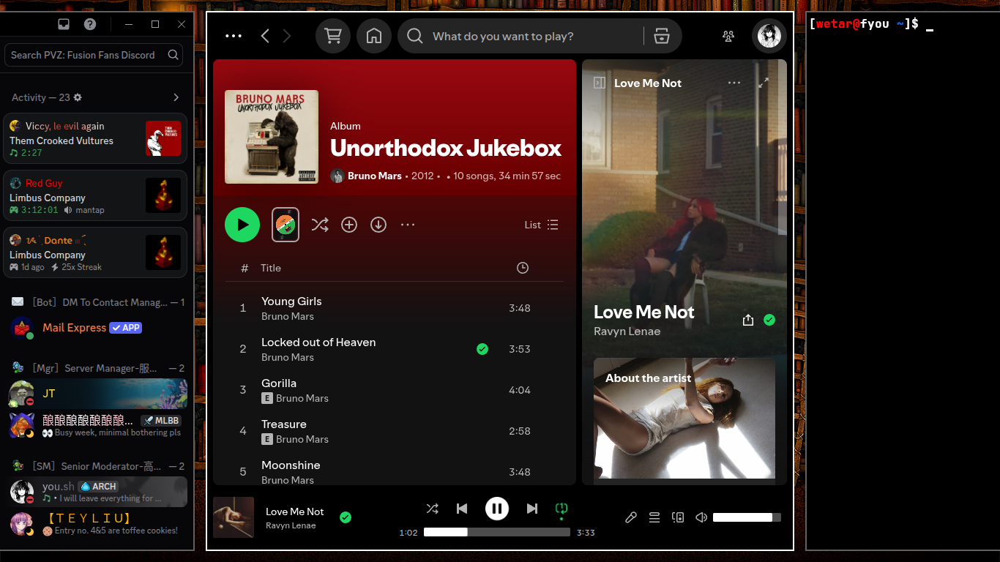
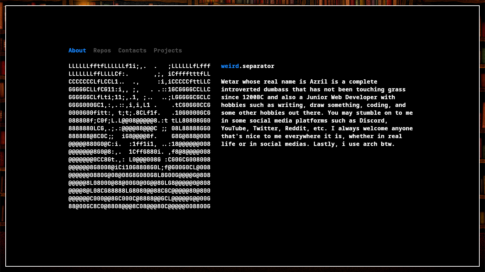
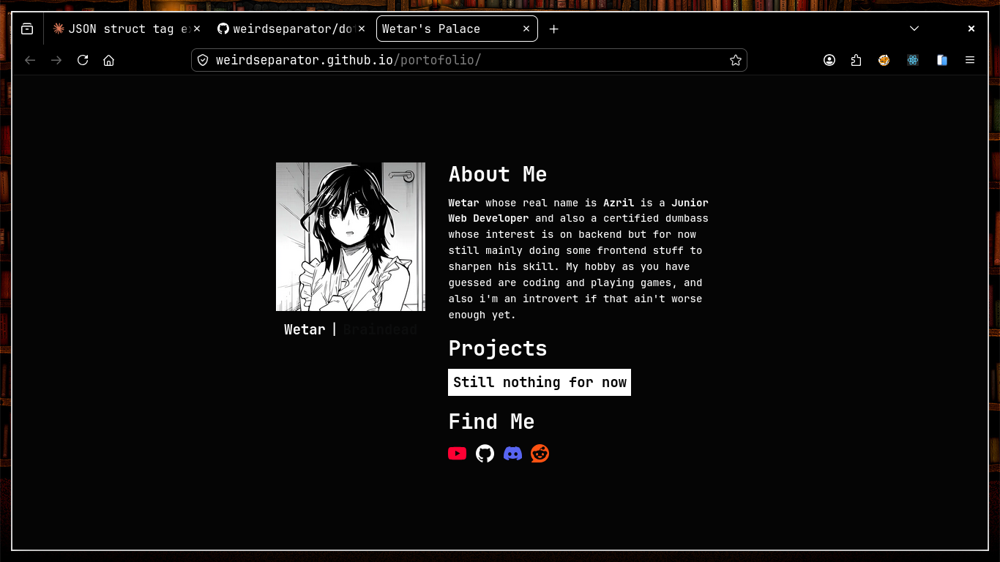
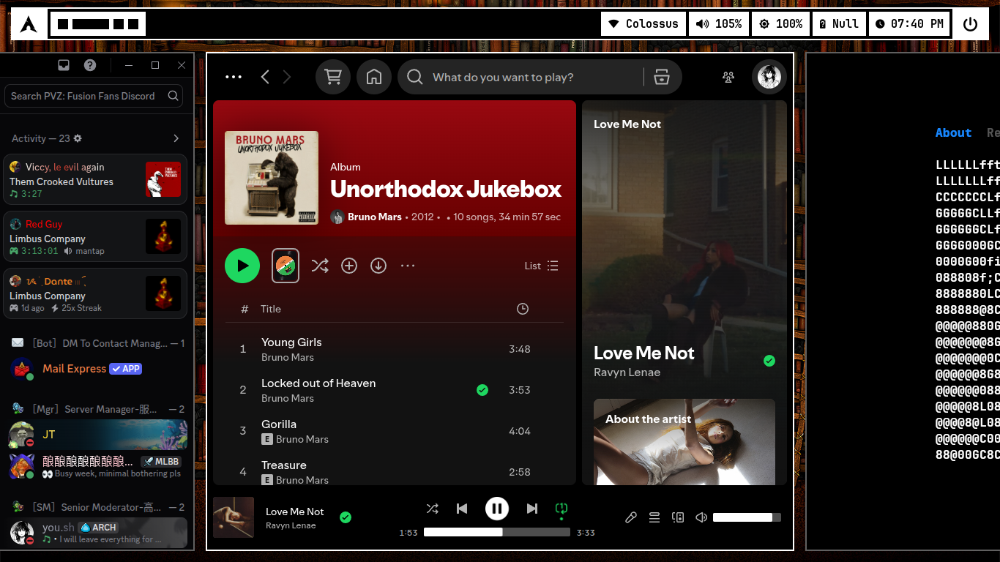

# Previews

# What
Monochrome themed niri dotfiles made by me for daily driving arch linux

# How
Just run `make install` and it will install this dotfiles into your machine. Any helps for mistakes and errors are always acceptable, it will be so good if you wanna make an issue for it. You still need to install the newest version of `tree-sitter-cli` from ur package manager or source
